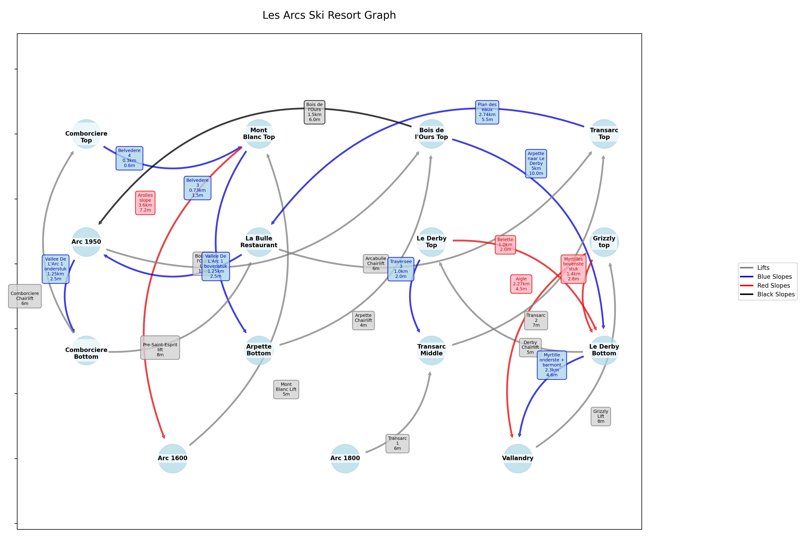

# skipath-finder



This set of scripts can calculate the most efficient path of ski slopes to achieve a skiable distance goal.

Visualize the ski area graph created in `load_graph.py` by running:
```python visualize_graph.py``` 

Calculate the shortest path, with the conditions defined in `optimizer.py` by running:
```python optimizer.py``` 

Run tests:
```python -m unittest test_optimizer.py```